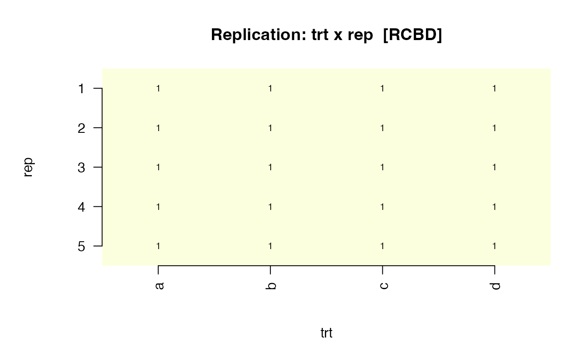
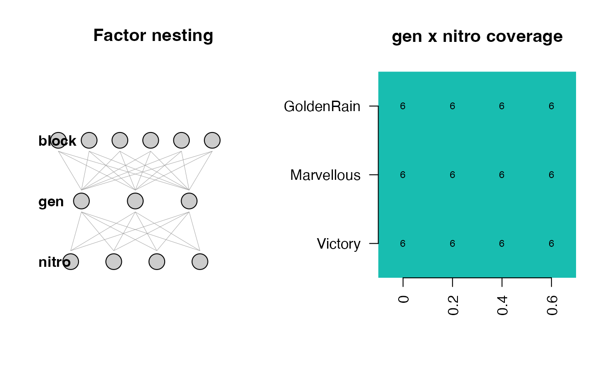

# Automatic design detection

`masque` ships an experimental-design detector. Given a tabular dataset,
[`detect_design()`](https://max578.github.io/masque/reference/detect_design.md)
returns the most likely design class — `CRD`, `RCBD`,
`IBD/alpha-lattice`, `row-column`, `split-plot`, `factorial`, or `none`
— with the per-rule evidence behind that choice.

The detector is read-only. It does not mutate `df`, does not change
[`mask()`](https://max578.github.io/masque/reference/mask.md) behaviour,
and never auto-corrects anything. It recommends a role assignment that
the user can accept, edit, or ignore.

Why bother? Two reasons. First, **structural awareness**: roles inferred
purely from column names miss treatments that lack a `^trt`-style name
(for example the `gen` column in an alpha-lattice). Second, **sanity
validation**: a one-line
[`plot()`](https://rdrr.io/r/graphics/plot.default.html) shows whether
what you think is the design is what’s actually in the data — a class of
bug field statisticians have lived with for decades.

## The verb in one line

``` r

ds <- detect_design(iris)
ds
#> ── design_summary  <CRD> ───────────────────────────────────────────────────────
#> • Treatment: Species
#> ── Alternates (top rule scores) ────────────────────────────────────────────────
#> x <CRD > score = 1.00
#> <RCBD > score = 0.00
#> <IBD/alpha-lattice > score = 0.00
#> ── Recommended role hints ──────────────────────────────────────────────────────
#> = Species -> treatment
#> ℹ Use `plot(x)` for a sanity-check visualisation; pass to `propose_roles(df, detect = TRUE)` to seed role hints.
```

The print method shows the picked class (`CRD`), the working treatment
(`Species`), and the top three alternates so you can see how confident
the call was. The full per-rule score is in `ds@scores`:

``` r

sort(ds@scores, decreasing = TRUE)
#>               CRD              RCBD IBD/alpha-lattice        row-column 
#>                 1                 0                 0                 0 
#>        split-plot         factorial 
#>                 0                 0
```

`ds@recommended_roles` is what gets overlaid on
[`propose_roles()`](https://max578.github.io/masque/reference/propose_roles.md)
when detection is on (the default since 0.3.0):

``` r

ds@recommended_roles
#>       col      role
#> 1 Species treatment
```

## Four worked cases

### CRD — Fisher’s `iris`

50 observations per species, no block, no spatial. Detection picks
`Species` as the working treatment.

``` r

plot(detect_design(iris), df = iris)
```


The left panel is replication-per-treatment; the right is per-column
missingness (0 % in `iris`).

### RCBD — synthetic randomised blocks

Five replicates of a 4-treatment design, every treatment in every block:

``` r

rcbd <- expand.grid(rep = 1:5, trt = factor(letters[1:4]))
rcbd$yield <- rnorm(nrow(rcbd))
ds_rcbd <- detect_design(rcbd)
ds_rcbd
#> ── design_summary  <RCBD> ──────────────────────────────────────────────────────
#> • Treatment: trt
#> • Blocks: rep
#> ── Alternates (top rule scores) ────────────────────────────────────────────────
#> x <RCBD > score = 0.95
#> <CRD > score = 0.40
#> <IBD/alpha-lattice > score = 0.00
#> ── Recommended role hints ──────────────────────────────────────────────────────
#> = trt -> treatment
#> = rep -> design
#> ℹ Use `plot(x)` for a sanity-check visualisation; pass to `propose_roles(df, detect = TRUE)` to seed role hints.
plot(ds_rcbd, df = rcbd)
```



The replication tile shows `trt x rep`; every cell has count 1 — the
defining RCBD signature.

### Split-plot — `agridat::yates.oats`

The classic 1935 split-plot oat trial: six blocks, three nitrogen levels
(whole-plot), three genotypes (sub-plot).

``` r

if (has_agridat) {
  oats <- agridat::yates.oats
  ds_oats <- detect_design(oats)
  ds_oats
  plot(ds_oats, df = oats)
}
```



Caveat: the detector cannot fully distinguish a true split-plot from a
factorial-in-blocks, because both have the same data layout. The
whole-plot / sub-plot assignment uses cardinality (fewer levels =
whole-plot), which is a heuristic, not a guarantee. If you know which
factor was actually randomised at the whole-plot level, override
`ds@whole_plot_col` / `ds@sub_plot_col` manually.

### Observational — `mtcars`

`mtcars` has no design at all. Every rule scores below the 0.5
threshold; the verdict is `"none"`.

``` r

ds_mt <- detect_design(mtcars)
ds_mt
#> ── design_summary  <none> ──────────────────────────────────────────────────────
#> ℹ No experimental design detected above threshold.
#> • Top rule scores all below 0.5. Treat as observational.
#> ── Alternates (top rule scores) ────────────────────────────────────────────────
#> <factorial > score = 0.46
#> <IBD/alpha-lattice > score = 0.30
#> <CRD > score = 0.00
#> ℹ Use `plot(x)` for a sanity-check visualisation; pass to `propose_roles(df, detect = TRUE)` to seed role hints.
plot(ds_mt, df = mtcars)
```


The plot now degrades gracefully: a fingerprint of treatment-frequency
(empty here — there is no treatment factor) and the per-column NA
pattern.

## Integration with `propose_roles()`

`propose_roles(df)` runs detection by default and folds the recommended
roles into the returned tibble. The detected `design_summary` is stashed
as `attr(roles, "design")` so you can
[`plot()`](https://rdrr.io/r/graphics/plot.default.html) it without
re-running the detector:

``` r

if (has_agridat) {
  roles <- propose_roles(agridat::john.alpha)
  print(attr(roles, "design")@class_label)
  print(roles[
    roles$role %in% c("treatment", "design"),
    c("col", "role", "notes")
  ])
}
#> [1] "IBD/alpha-lattice"
#> # A tibble: 6 × 3
#>   col   role      notes                                                         
#>   <chr> <chr>     <chr>                                                         
#> 1 plot  design    Design-pattern name -> design (byte-identical).               
#> 2 rep   design    Design-pattern name -> design (byte-identical).               
#> 3 block design    Design-pattern name -> design (byte-identical).               
#> 4 gen   treatment detect_design: covariate -> treatment (was: Default -> covari…
#> 5 row   design    Design-pattern name -> design (byte-identical).               
#> 6 col   design    Design-pattern name -> design (byte-identical).
```

Without detection (v0.2 behaviour), `gen` would have been left as
`covariate` because its column name does not match any treatment regex.
The structural detector promotes it.

Pass `detect = FALSE` to disable:

``` r

roles_v2 <- propose_roles(iris, detect = FALSE)
roles_v2$role[roles_v2$col == "Species"]
#> [1] "covariate"
```

## Caveats and limits

- **Heuristic, not guarantee.** The rule engine matches structural
  signatures; it does not know which factor was randomised at which
  level. Always treat the recommendation as a starting point.
- **Split-plot vs factorial.** Structurally identical when the
  whole-plot and sub-plot factors are both fully crossed within each
  block. The detector picks split-plot only when a design-named block
  factor is present and the smaller-cardinality candidate becomes the
  whole-plot.
- **Small fixtures.** Detection of structure on fewer than 20 rows is
  unreliable. When in doubt, pass `detect = FALSE` and assign roles by
  hand.
- **Optional interactive prompts.** Pass `interactive = TRUE` to be
  asked to disambiguate when the top-two rule scores are within
  `tie_delta`. By default the simpler design wins ties.
- **Detection is read-only.** It never changes
  [`mask()`](https://max578.github.io/masque/reference/mask.md)
  synthesis behaviour. Only
  [`propose_roles()`](https://max578.github.io/masque/reference/propose_roles.md)
  consumes its output, and only as role hints.
